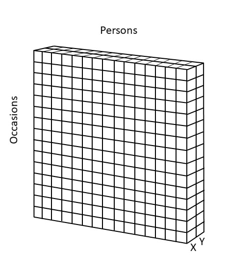
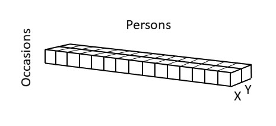
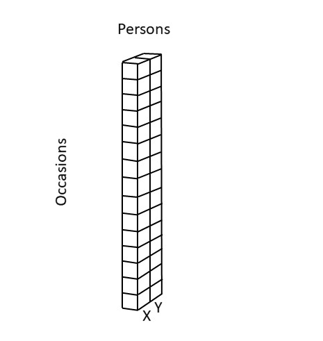

# Introduction

This serves as supporting materials to the manuscript entitled "The Curious Case of the Cross-Sectional Correlation", which I wrote for the special issue of Multivariate Behavioral Research in honor of Peter Molenaar's work.

Peter Molenaar showed that when ergodicity is absent--meaning that individuals are characterized by different means, variances, covariances, et cetera--the results obtained from cross-sectional data will not adequately reflect the patterns that exist at the individual level. 

Researchers inspired by Molenaar's work have considered how the cross-sectional correlation is related to the correlation of a single individual, which I refer to as the person-specific correlation. How these two correlations are related, is explained and illustrated with several numerical examples below. The outline is as follows:

* An intuitive presentation of the two correlations of interest

* General set up of the simulations, including the introduction of other correlations and quantities that are needed to connect the cross-sectional correlation to the person-specific correlation

* Examples based on specific constellations of parameter values, and simulated data from which specific correlations of interest are estimated


# Two correlations of interest
To get an initial understanding of the difference between the cross-sectional correlation and the person-specific correlation, it is helpful to make use of Cattell's databox. Cattell's databox shows that there are three dimensions in which we can sample: variables, persons, and time points. 

Here we will consider only the latter two dimensions, while keeping the variables fixed: These are referred to as $X$ and $Y$. The databox then can be visualized as


{width=60%}

When considering __cross-sectional data__, we obtain a horizontal slice from this databox, consisting of one occasion and many persons, which can be visualized as

{width=60%}

When consider __single subject ($N=1$)__ data, we obtain a slice in the vertical direction, which can be visualized as

{width=60%}

When looking at the databox in this way, it is not difficult to imagine that different individuals may be characterized by different person-specific correlations. Hence, in general the person-specific correlation will not be identical to the cross-sectional correlation.

In the paper, I show how the following expression for the cross-sectional correlation can be derived:

$$ \rho = \eta_{BX}\eta_{BY}\rho_B + \eta_{WX}\eta_{WY}\rho_W$$

where


* $\eta^2_{BX}$ is the intraclass correlation of $X$ (proportion of stable differences between persons in X)

* $\eta^2_{BY}$ is the intraclass correlation of $Y$ (proportion of stable differences between persons in Y)

* $\rho_B$ is the between-person correlation (correlation of person-specific means)

* $\eta^2_{WX} = 1 - \eta^2_{BX}$ is the proportion of variance of $X$ not due to stable differences between persons)

* $\eta^2_{WY} = 1 - \eta^2_{BY}$ the proportion of variance of $Y$ not due to stable differences between persons)

* $\rho_W$ is the within-person correlation (correlation across people of temporal deviation from person-specific means)

# Two curiosities

The expression for the cross-sectional correlation is well known in certain parts of the scientific literature. However, despite the simple appearance of this expression, there are two curiosities associated with it that I present in the paper.

The __first curiosity__ is concerned with the difference between the within-person correlation, which is part of the expression for the cross-sectional correlation given above, and the average person-specific correlation, which is what we are interested in based on Cattell's databox, that is,

$$\rho_W = \frac{E[cov(X,Y|P)]}{\sqrt{E[var(X|P)]}]\sqrt{E[var(Y|P)]}} \;\;\;\;\; \mathrm{versus} \;\;\;\;\;\;\;\kappa = E\Biggl[ \frac{cov(X,Y|P)}{\sqrt{var(X|P)}\sqrt{var(Y|P)}}\Biggr].$$

These two correlations are only the same under specific circumstances (such as ergodicity).

The __second curiosity__ has to do with the weights in the expression for the cross-sectional correlation given above. Unless the intraclass correlations are the same for $X$ and $Y$, these two weights do not add up to one. Specifically,
$$0 \leq \eta_{BX}\eta_{BY} + \eta_{WX}\eta_{WY} \leq 1.$$ 
As a result of this, the cross-sectional correlation $\rho$ does not necessarily lie in between the between-person correlation $\rho_B$ and the within-person correlation $\rho_W$, but may lie closer to zero than both of them. 


# General approach
In the paper, seven examples are given that illustrate how these two curiosities combined may affect the results. The examples are based on chosing certain values for some of the parameters, and using analytical results presented in the paper to compute the other parameters. In addition, data are simulated from which an estimate of the cross-sectional correlation is obtained. A file only containing the R-code that is used below can be found 
[here](https://github.com/ellenhamaker/cross-sectional-correlation/blob/main/RcodeCorrelation.R).

To create heterogeneity in the population with respect to the within-person distribution, a scenario is used in which the total population consists of two subpopulations that both make up exactly half of the population. In this scenario, we only have to specify two sets of parameters for the within-person part (i.e., two values for the person-specific covariance, and two values for the person-specific variances). The mean differences between persons will come from a multivariate normal distribution.


## Step 1

First, we have to __choose values__ for the following parameters

* $cov(X|P)$ -- the person-specific covariance

* $var(X|P)$ and $var(Y|P)$ -- the person-specific variances

Withe these, we can simulate the within-person components per person.

Additionally, we can use these parameter to __compute values__ for the following parameters

* $\kappa_p$ -- the person-specific correlation

* $\kappa$ -- the average person-specific correlation

* $\sigma_{XY}$ -- the average person-specific covariance

* $\sigma^2_{X}$ and $\sigma^2_{Y}$ -- the average person-specific variances

* $\rho_W$ -- the within-person correlation

## Step 2

Second, we need to choose and compute the parameters that defined the between-person level. Here we __choose values__ for the following parameters

* $\eta_{BX}^2$ and $\eta_{BY}^2$ -- the intraclass correlations of $X$ and $Y$

* $\rho_B$ -- the between-person correlation

Based on these we can __compute values__ for the following parameters

* $\sigma_{BX}^2$ and $\sigma_{BY}^2$ -- the between-person variances of $X$ and $Y$


* $\sigma_{BX, BY}$ -- the between-person covariance

With these values, we can simulate the between-person components per person.

In addition, we can now __compute the value__ of

* $\rho$ -- the cross-sectional correlation

Note that, instead of choosing the intraclass correlations and between-person correlation, we could also have chosen the between-person variances and covariance, and computed the others from them. This would work equally well; the current approach is chosen, simply because it allows for more direct control over (and tinkering ease of) the contributions of the various components that are needed in the expression for the cross-sectional correlation.


# Example 1

In this first example from the paper, I will elaborate a bit more on the details in each of the steps. The example is based on individuals having different person-specific variances, but the same person-specific covariance; as a result they have different person-specific correlations. The between-person correlation is set to be equal to the average person-specific correlation. The intraclass correlations will be somewhat different, but not extremely different.   

## Analytical part

### Step 1

In the first example in the paper we have:

| Quantity| Value |
|:-----------|:----------------------------|
$cov(X,Y|P)$ | 1 in all individuals|
$var(X|P)$ | 1.25 in half of the individuals; 5 in the other half|
$var(Y|P)$ | identical to $var(X|P)$|

Including these in matrices, we get:

```{r block2, echo=T, eval=T, message=F, include=params$rcode}
# Specify two person-specific covariance matrices for two subpopulations
cov.mat1 <- matrix(c(1.25,1,1,1.25),2,2)
cov.mat2 <- matrix(c(5,1,1,5),2,2)
```

Based on this we can compute:

* the person-specific correlation in the first half of the population: 

$$\kappa_p = \frac{cov(X,Y|P)}{\sqrt{var(X|P)}\sqrt{var(Y|P)}}=\frac{1}{1.25} = 0.8$$

* the person-specific correlation in the other half of the population: 

$$\kappa_p = \frac{cov(X,Y|P)}{\sqrt{var(X|P)}\sqrt{var(Y|P)}} = \frac{1}{5} = 0.2$$

Fromt these we can compute the average person-specific correlation: 

$$\kappa = E\Biggl[\frac{cov(X,Y|P)}{\sqrt{var(X|P)}\sqrt{var(Y|P)}}\Biggr]= \frac{0.8+0.2}{2} = 0.5$$

```{r block3, echo=T, eval=T, message=F, include=params$rcode}
# The average person-specific correlation can be determined
kappa1 <- cov.mat1[2,1]/(sqrt(cov.mat1[1,1])*sqrt(cov.mat1[2,2]))
kappa2 <- cov.mat2[2,1]/(sqrt(cov.mat2[1,1])*sqrt(cov.mat2[2,2]))
kappa <- (kappa1+kappa2)/2
kappa
```


We can also compute:

* the average person-specific covariance: $$\sigma_{XY} = E[cov(X,Y|P)] = \frac{1+1}{2} = 1$$

* the average person-specific variances: $$\sigma_{X}^2 = E[var(X|P)] = \frac{1.25+5}{2} = 3.125 \;\;\;\;\;\; \mathrm{and} \;\;\;\;\;\; \sigma_{Y}^2 = E[var(Y|P)] = \frac{1.25+5}{2} = 3.125$$

From these we can compute the correlation of within-person deviations: $$\rho_W = \frac{\sigma_{XY}}{\sigma_{X}\sigma_{Y}} = \frac{1}{3.125} = 0.32$$


```{r block4, echo=T, eval=T, message=F, include=params$rcode}
# Determine the average person-specific variances and covariance
var.wX <- (cov.mat1[1,1] + cov.mat2[1,1])/2
var.wY <- (cov.mat1[2,2] + cov.mat2[2,2])/2
cov.wXwY <- (cov.mat1[2,1]+cov.mat2[2,1])/2

# From these the within-person correlation can be computed:
rhoW <- cov.wXwY/(sqrt(var.wX)*sqrt(var.wY))
rhoW
```

This already shows that $\kappa \neq \rho_W$, that is, the average person-specific correlation is not (always) the same as the within-person correlation $\rho_W$ from the expression for the cross-lagged correlation. 

### Step 2
In the second step we add the between strucuture; this implies we will have individual differences in the person-specific means $E(X|P)$ and $E(Y|P)$. We could do this by simply specifying the covariance and variances of these mean differences (i.e., $\sigma_{BX,BY}$, $\sigma_{BX}^2$, and $\sigma_{BY}^2$); from these we could determine the intraclass correlations $\eta_{BX}^2$ and $\eta_{BY}^2$, and the between-person correlation $\rho_B$, which all three are used in the expression for the cross-sectional correlation presented above. 

To allow for more informed decisions when choosing the parameters that define the between-person level, we do it the other way around. Hence we specify the intraclass correlations and by using the average within-person variances obtained above, we can compute the between-person variances from these. That is, we know
$$ \eta^2_{BX} = \frac{\sigma_{BX}^2}{\sigma_X^2}=\frac{\sigma_{BX}^2}{\sigma_{BX}^2+\sigma_{WX}^2}.$$
Frm this, we can get an expression of the between-person variance as a funciton of the intraclass correlation and the average within-person correlation, through
$$\eta^2_{BX}\bigl(\sigma_{BX}^2+\sigma_{WX}^2\bigr) =\eta^2_{BX}\sigma_{BX}^2+\eta^2_{BX}\sigma_{WX}^2 = \sigma_{BX}^2$$
and thus $$\eta^2_{BX}\sigma_{WX}^2 = \sigma_{BX}^2 - \eta^2_{BX}\sigma_{BX}^2 = \bigl( 1 - \eta^2_{BX}\bigr)\sigma_{BX}^2$$ 
so that 
$$\sigma_{BX}^2 = \frac{\eta^2_{BX}\sigma_{WX}^2}{1 - \eta^2_{BX}}$$ 

For the between-person variance of $Y$ we can use the average within-person variance of $Y$ and the intraclass correlation that we specify for $Y$.

Once we have the between-person variances and we have chosen a value for the between-person correlation, we can also get the between-person covariance; this is not needed to compute what the cross-sectional correlation will be, but it is needed if we want to simulate data. 


IN the first exaple in the paper, I choose:

| Quantity| Value |
|:-----------|:----------------------------|
$\eta^2_{BX}$ | 0.4
$\eta^2_{BY}$ | 0.5
$\rho_B$| 0.5

Note that the between-person correlation is chosen to be identical to the average person-specific correlation (i.e., $\kappa = \rho_B$, but we could have chosen any other value between -1 and 1. 

```{r block5, echo=T, eval=T, message=F, include=params$rcode}
# Specify the correlation at the between-person level
# and choose the intraclass correlations for X and Y
rhoB <- 0.5
icc.X <- 0.4
icc.Y <- 0.5
```

From these values, we can compute:

* the between-person variance on $X$: $$var(E[X|P]) = \sigma_{BX}^2 = \frac{1-\eta^2_{BX}}{\eta^2_{BX}\sigma_{WX}^2} = \frac{0.4*3.125}{1-0.4} = 2.083$$

* the between-person variance on $Y$: $$var(E[Y|P]) = \sigma_{BY}^2 = \frac{1-\eta^2_{BY}}{\eta^2_{BY}\sigma_{WY}^2} = \frac{0.5*3.125}{1-0.5} = 3.125$$


* the between-person covariance: $$cov(E[X,Y|P]) = \sigma_{BX}\sigma_{BY}\rho_B = \sqrt{2.083}\sqrt{3.125}*0.5 = 1.276$$

```{r block6, echo=T, eval=T, message=F, include=params$rcode}
# Compute the between-person variances based on the icc's and the average 
# person-specific variances
var.bX <- icc.X*var.wX/(1-icc.X)
var.bX
var.bY <- icc.Y*var.wY/(1-icc.Y)
var.bY

# Compute the between-person covariance based on the between-person correlation
# and the between-person variances
cov.bXbY <- rhoB*sqrt(var.bX)*sqrt(var.bY)
cov.bXbY

# Place these values in a covariance matrix
cov.mat.B <- matrix(c(var.bX,cov.bXbY,cov.bXbY,var.bY),2,2)
```

Now we can compute the value for the cross-sectional correlation:
$$ \rho = \eta_{BX}\eta_{BY}\rho_B + \eta_{WX}\eta_{WY}\rho_W = \sqrt{0.4}*\sqrt{0.5}*0.5 + \sqrt{0.5}*\sqrt{0.4}*0.32 = 0.399  $$

```{r block7, echo=T, eval=T, message=F, include=params$rcode}
# Compute the cross-sectional correlation
rho <- sqrt(icc.X)*sqrt(icc.Y)*rhoB + sqrt(1-icc.X)*sqrt(1-icc.Y)*rhoW
rho
```


## Simulate data
Based on the parameter values defined above, we can now simulate data. For this, we have to decide how many persons and how many time points we want. We also need to load the package mvtnorm, to sample from a multivariate normal distribution. To make our results reproducable, we set a seed.  


```{r block8, echo=T, eval=T, message=F, include=params$rcode}
library(mvtnorm)

set.seed(8427)

# Total sample size
N <- 1000   # number pf persons
TP <- 1000   # number of time points
```


### Simulate BP components
We start with simulating the person-specific means using the covariance and variances from the between-person components. We set the grand means to zero in this simulations. 

We thus have 
$$ \begin{bmatrix} E[X|P] \\ E[Y|P] \end{bmatrix} 
\sim MVN \Biggl(\begin{bmatrix} 0\\0\end{bmatrix}, 
\begin{bmatrix} \sigma_{BX}^2 \\
\sigma_{BX,BY} & \sigma_{BY}^2\end{bmatrix} \Biggr)$$


```{r block9, echo=T, eval=T, message=F, include=params$rcode}
# Place the between-person covariance and variances in a matrix, and use this
# to simulate the person-specific means (between-person components)
cov.mat.B <- matrix(c(var.bX,cov.bXbY,cov.bXbY,var.bY),2,2)
means.XY <- rmvnorm(N,mean = c(0,0),sigma = cov.mat.B)
cov(means.XY) 
cor(means.XY)
```

### Simulate WP components
Here, we simulate the within-person components, and add the between-person component right away to get the actual scores. We do this per person using

$$ \begin{bmatrix} X_{pt} \\ Y_{pt} \end{bmatrix} 
\sim MVN \Biggl(\begin{bmatrix} E[X|P] \\ E[Y|P] \end{bmatrix} , 
\begin{bmatrix} var(X|P) \\
cov(X,Y|P) & var(Y|P)\end{bmatrix} \Biggr)$$

We start with creating matrices to save the scores on $X$ and $Y$; these can be thought of as slices from Cattell's databox.

```{r block10, echo=T, eval=T, message=F, include=params$rcode}
# Create two matrices to contain the scores on X and Y 
# for TP repeated measures (rows) and for N persons (columns)
X <- matrix(,TP,N)
Y <- matrix(,TP,N)

```

Next, we sample values for individuals from both subpopulations


```{r block11, echo=T, eval=T, message=F, include=params$rcode}
# Create data for the first subpopulation
for (i in 1:(N/2))
{ Z <- rmvnorm(TP, mean = means.XY[i,], sigma = cov.mat1)
  X[,i] <- Z[,1] 
  Y[,i] <- Z[,2]
}

# Create data fro the second subpopulation
for (i in ((N/2)+1):N)
{ Z <- rmvnorm(TP, mean = means.XY[i,], sigma = cov.mat2)
  X[,i] <- Z[,1]
  Y[,i] <- Z[,2]
}
```


## Analyze data
Now that we have the data, we can analyze them in various ways. First, we will estimated the means per person and their correlation $\kappa_p$.To this end we need to create matrices that can contain these quantities 

```{r block12, echo=T, eval=T, message=F, include=params$rcode}
# Create matrices to contain estimates of the person-specific 
# means and correlations for N persons
hat.means.XY <- matrix(,N,2)
hat.kappa.p <- matrix(,N,1)
```

To obtain the estimated person-specific means and correlation, we make use of
```{r block13, echo=T, eval=T, message=F, include=params$rcode}
# Create matrices to contain estimates of the person-specific 
# means and correlations for N persons
for (p in 1:N)
{ Xp <- X[,p]
  Yp <- Y[,p]
  hat.means.XY[p,] <- c(mean(Xp),mean(Yp))
  hat.kappa.p[p,1] <- cor(Xp,Yp)
}
# Average person-specific correlation:
mean(hat.kappa.p)
# Compare to true value:
kappa
# Histogram
hist(hat.kappa.p, breaks=100, xlim=c(0,1))
```


Now we can estimate the average person-specific correlation 
```{r block14, echo=T, eval=T, message=F, include=params$rcode}
# Average person-specific correlation:
mean(hat.kappa.p)
# Compare to true value:
kappa
```

and the between-person correlation
```{r block15, echo=T, eval=T, message=F, include=params$rcode}
# Between-person correlation 
cor(hat.means.XY)
# Compare to true value:
rhoB
```

We can also estimate the within-person correlation $\rho_W$ and the cross-sectional correlation $\rho$; this can be done for every time point separately. We therefore start with making matrices to contain these 


```{r block16, echo=T, eval=T, message=F, include=params$rcode}
# Create matrices to contain estimates of the within-person correlation 
# and the cross-sectional correlation
hat.rhoW <- matrix(,TP,1)
hat.rho <- matrix(,TP,1)
```

Next, for every time point, we compute the within-person component (using the estimated person means), and determine the correlation of these across individuals (i.e., an estimate of $\rho_W$), and we estimate the cross-sectional correlation (i.e., $\rho$):

```{r block17, echo=T, eval=T, message=F, include=params$rcode}
# Create matrices to contain estimates of the person-specific 
# means and correlations for N persons
for (t in 1:TP)
{ Xt <- X[t,]
  Yt <- Y[t,]
  WXt <- X[t,] - hat.means.XY[,1]
  WYt <- Y[t,] - hat.means.XY[,2]
  hat.rhoW[t,] <- cor(WXt,WYt)
  hat.rho[t,] <- cor(Xt,Yt)
}
# Average person-specific correlation:
mean(hat.rhoW)
mean(hat.rho)

hist(hat.rhoW, breaks=20, xlim=c(0,1), 
     main="Estimated WP correlation for TP occasions")
abline(v=rhoW, col="red", lwd=2)
hist(hat.rho, breaks=20, xlim=c(0,1), 
     main="Estimated cross-sectional correlation for TP occasions")
abline(v=rho, col="red", lwd=2)
```

The estimated cross-sectional correlation for the first wave is
```{r block18, echo=T, eval=T, message=F, include=params$rcode}
# Cross-sectional correlation for the first wave (reported in the paper)
hat.rho[1,1]

```


# Example 2

The second example uses the same parameter values as the first, except for the intraclass correlations. 

## Analytical part

### Step 1

As in the first example in the paper we have:

| Quantity| Value |
|:-----------|:----------------------------|
$cov(X,Y|P)$ | 1 in all individuals|
$var(X|P)$ | 1.25 in half of the individuals; 5 in the other half|
$var(Y|P)$ | identical to $var(X|P)$|

Including these in matrices, we get:

```{r block2b, echo=T, eval=T, message=F, include=params$rcode}
# Specify two person-specific covariance matrices for two subpopulations
cov.mat1 <- matrix(c(1.25,1,1,1.25),2,2)
cov.mat2 <- matrix(c(5,1,1,5),2,2)
```


From these we compute:

```{r block3b, echo=T, eval=T, message=F, include=params$rcode}
# The average person-specific correlation can be determined
kappa1 <- cov.mat1[2,1]/(sqrt(cov.mat1[1,1])*sqrt(cov.mat1[2,2]))
kappa2 <- cov.mat2[2,1]/(sqrt(cov.mat2[1,1])*sqrt(cov.mat2[2,2]))
kappa <- (kappa1+kappa2)/2
kappa
```


as well as:


```{r block4b, echo=T, eval=T, message=F, include=params$rcode}
# Determine the average person-specific variances and covariance
var.wX <- (cov.mat1[1,1] + cov.mat2[1,1])/2
var.wY <- (cov.mat1[2,2] + cov.mat2[2,2])/2
cov.wXwY <- (cov.mat1[2,1]+cov.mat2[2,1])/2

# From these the within-person correlation can be computed:
rhoW <- cov.wXwY/(sqrt(var.wX)*sqrt(var.wY))
rhoW
```

This already shows that $\kappa \neq \rho_W$, that is, the average person-specific correlation is not (always) the same as the within-person correlation $\rho_W$ from the expression for the cross-lagged correlation. 

### Step 2
For the between part we use the following values:

| Quantity| Value |
|:-----------|:----------------------------|
$\eta^2_{BX}$ | 0.1
$\eta^2_{BY}$ | 0.9
$\rho_B$| 0.5


```{r block5b, echo=T, eval=T, message=F, include=params$rcode}
# Specify the correlation at the between-person level
# and choose the intraclass correlations for X and Y
rhoB <- 0.5
icc.X <- 0.1
icc.Y <- 0.9
```

From these values, we can compute:

```{r block6b, echo=T, eval=T, message=F, include=params$rcode}
# Compute the between-person variances based on the icc's and the average 
# person-specific variances
var.bX <- icc.X*var.wX/(1-icc.X)
var.bX
var.bY <- icc.Y*var.wY/(1-icc.Y)
var.bY

# Compute the between-person covariance based on the between-person correlation
# and the between-person variances
cov.bXbY <- rhoB*sqrt(var.bX)*sqrt(var.bY)
cov.bXbY

# Place these values in a covariance matrix
cov.mat.B <- matrix(c(var.bX,cov.bXbY,cov.bXbY,var.bY),2,2)
```

Now we can compute the value for the cross-sectional correlation:


```{r block7b, echo=T, eval=T, message=F, include=params$rcode}
# Compute the cross-sectional correlation
rho <- sqrt(icc.X)*sqrt(icc.Y)*rhoB + sqrt(1-icc.X)*sqrt(1-icc.Y)*rhoW
rho
```


## Simulate data
Based on the parameter values defined above, we can now simulate data. 

```{r block8b, echo=T, eval=T, message=F, include=params$rcode}
set.seed(3482)

# Total sample size
N <- 1000   # number pf persons
TP <- 1000   # number of time points
```


### Simulate BP components
We start with simulating the person-specific means using the covariance and variances from the between-person components. We set the grand means to zero in this simulations. 

```{r block9b, echo=T, eval=T, message=F, include=params$rcode}
# Place the between-person covariance and variances in a matrix, and use this
# to simulate the person-specific means (between-person components)
cov.mat.B <- matrix(c(var.bX,cov.bXbY,cov.bXbY,var.bY),2,2)
means.XY <- rmvnorm(N,mean = c(0,0),sigma = cov.mat.B)
cov(means.XY) 
cor(means.XY)
```

### Simulate WP components
Here, we simulate the within-person components, and add the between-person component right away to get the actual scores. We do this per person using

We start with creating matrices to save the scores on $X$ and $Y$; these can be thought of as slices from Cattell's databox.

```{r block10b, echo=T, eval=T, message=F, include=params$rcode}
# Create two matrices to contain the scores on X and Y 
# for TP repeated measures (rows) and for N persons (columns)
X <- matrix(,TP,N)
Y <- matrix(,TP,N)

```

Next, we sample values for individuals from both subpopulations

```{r block11b, echo=T, eval=T, message=F, include=params$rcode}
# Create data for the first subpopulation
for (i in 1:(N/2))
{ Z <- rmvnorm(TP, mean = means.XY[i,], sigma = cov.mat1)
  X[,i] <- Z[,1] 
  Y[,i] <- Z[,2]
}

# Create data fro the second subpopulation
for (i in ((N/2)+1):N)
{ Z <- rmvnorm(TP, mean = means.XY[i,], sigma = cov.mat2)
  X[,i] <- Z[,1]
  Y[,i] <- Z[,2]
}
```


## Analyze data
Now that we have the data, we can analyze them in various ways. First, we will estimated the means per person and their correlation $\kappa_p$.To this end we need to create matrices that can contain these quantities 

```{r block12b, echo=T, eval=T, message=F, include=params$rcode}
# Create matrices to contain estimates of the person-specific 
# means and correlations for N persons
hat.means.XY <- matrix(,N,2)
hat.kappa.p <- matrix(,N,1)
```

To obtain the estimated person-specific means and correlation, we make use of
```{r block13b, echo=T, eval=T, message=F, include=params$rcode}
# Create matrices to contain estimates of the person-specific 
# means and correlations for N persons
for (p in 1:N)
{ Xp <- X[,p]
  Yp <- Y[,p]
  hat.means.XY[p,] <- c(mean(Xp),mean(Yp))
  hat.kappa.p[p,1] <- cor(Xp,Yp)
}
# Average person-specific correlation:
mean(hat.kappa.p)
# Compare to true value:
kappa
# Histogram
hist(hat.kappa.p, breaks=100, xlim=c(0,1))
```


Now we can estimate the average person-specific correlation 
```{r block14b, echo=T, eval=T, message=F, include=params$rcode}
# Average person-specific correlation:
mean(hat.kappa.p)
# Compare to true value:
kappa
```

and the between-person correlation
```{r block15b, echo=T, eval=T, message=F, include=params$rcode}
# Between-person correlation 
cor(hat.means.XY)
# Compare to true value:
rhoB
```

We can also estimate the within-person correlation $\rho_W$ and the cross-sectional correlation $\rho$; this can be done for every time point separately. We therefore start with making matrices to contain these 


```{r block16b, echo=T, eval=T, message=F, include=params$rcode}
# Create matrices to contain estimates of the within-person correlation 
# and the cross-sectional correlation
hat.rhoW <- matrix(,TP,1)
hat.rho <- matrix(,TP,1)
```

Next, for every time point, we compute the within-person component (using the estimated person means), and determine the correlation of these across individuals (i.e., an estimate of $\rho_W$), and we estimate the cross-sectional correlation (i.e., $\rho$):

```{r block17b, echo=T, eval=T, message=F, include=params$rcode}
# Create matrices to contain estimates of the person-specific 
# means and correlations for N persons
for (t in 1:TP)
{ Xt <- X[t,]
  Yt <- Y[t,]
  WXt <- X[t,] - hat.means.XY[,1]
  WYt <- Y[t,] - hat.means.XY[,2]
  hat.rhoW[t,] <- cor(WXt,WYt)
  hat.rho[t,] <- cor(Xt,Yt)
}
# Average person-specific correlation:
mean(hat.rhoW)
mean(hat.rho)

hist(hat.rhoW, breaks=20, xlim=c(0,1), 
     main="Estimated WP correlation for TP occasions")
abline(v=rhoW, col="red", lwd=2)
hist(hat.rho, breaks=20, xlim=c(0,1), 
     main="Estimated cross-sectional correlation for TP occasions")
abline(v=rho, col="red", lwd=2)
```

The estimated cross-sectional correlation for the first wave is
```{r block18b, echo=T, eval=T, message=F, include=params$rcode}
# Cross-sectional correlation for the first wave (reported in the paper)
hat.rho[1,1]

```


# Example 3

The second third example, individuals have different person-specific covariances, while the person-specific variances are the same for everyone. 

## Analytical part

### Step 1

In the third example in the paper we have:

| Quantity| Value |
|:-----------|:----------------------------|
$cov(X,Y|P)$ | 4 in half of the population; 5 in the other half
$var(X|P)$ | 10 in all individuals in the population
$var(Y|P)$ | identical to $var(X|P)$|

Including these in matrices, we get:

```{r block2c, echo=T, eval=T, message=F, include=params$rcode}
# Specify two person-specific covariance matrices for two subpopulations
cov.mat1 <- matrix(c(10,5,5,10),2,2)
cov.mat2 <- matrix(c(10,4,4,10),2,2)
```


From these we compute:

```{r block3c, echo=T, eval=T, message=F, include=params$rcode}
# The average person-specific correlation can be determined
kappa1 <- cov.mat1[2,1]/(sqrt(cov.mat1[1,1])*sqrt(cov.mat1[2,2]))
kappa2 <- cov.mat2[2,1]/(sqrt(cov.mat2[1,1])*sqrt(cov.mat2[2,2]))
kappa <- (kappa1+kappa2)/2
kappa
```


as well as:


```{r block4c, echo=T, eval=T, message=F, include=params$rcode}
# Determine the average person-specific variances and covariance
var.wX <- (cov.mat1[1,1] + cov.mat2[1,1])/2
var.wY <- (cov.mat1[2,2] + cov.mat2[2,2])/2
cov.wXwY <- (cov.mat1[2,1]+cov.mat2[2,1])/2

# From these the within-person correlation can be computed:
rhoW <- cov.wXwY/(sqrt(var.wX)*sqrt(var.wY))
rhoW
```

This already shows that $\kappa \neq \rho_W$, that is, the average person-specific correlation is not (always) the same as the within-person correlation $\rho_W$ from the expression for the cross-lagged correlation. 

### Step 2
For the between part we use the following values:

| Quantity| Value |
|:-----------|:----------------------------|
$\eta^2_{BX}$ | 0.2
$\eta^2_{BY}$ | 0.8
$\rho_B$| 0.5


```{r block5c, echo=T, eval=T, message=F, include=params$rcode}
# Specify the correlation at the between-person level
# and choose the intraclass correlations for X and Y
rhoB <- 0.45
icc.X <- 0.2
icc.Y <- 0.8
```

From these values, we can compute:

```{r block6c, echo=T, eval=T, message=F, include=params$rcode}
# Compute the between-person variances based on the icc's and the average 
# person-specific variances
var.bX <- icc.X*var.wX/(1-icc.X)
var.bX
var.bY <- icc.Y*var.wY/(1-icc.Y)
var.bY

# Compute the between-person covariance based on the between-person correlation
# and the between-person variances
cov.bXbY <- rhoB*sqrt(var.bX)*sqrt(var.bY)
cov.bXbY

# Place these values in a covariance matrix
cov.mat.B <- matrix(c(var.bX,cov.bXbY,cov.bXbY,var.bY),2,2)
```

Now we can compute the value for the cross-sectional correlation:


```{r block7c, echo=T, eval=T, message=F, include=params$rcode}
# Compute the cross-sectional correlation
rho <- sqrt(icc.X)*sqrt(icc.Y)*rhoB + sqrt(1-icc.X)*sqrt(1-icc.Y)*rhoW
rho
```


## Simulate data
Based on the parameter values defined above, we can now simulate data. 

```{r block8c, echo=T, eval=T, message=F, include=params$rcode}
set.seed(4497)

# Total sample size
N <- 1000   # number pf persons
TP <- 1000   # number of time points
```


### Simulate BP components
We start with simulating the person-specific means using the covariance and variances from the between-person components. We set the grand means to zero in this simulations. 

```{r block9c, echo=T, eval=T, message=F, include=params$rcode}
# Place the between-person covariance and variances in a matrix, and use this
# to simulate the person-specific means (between-person components)
cov.mat.B <- matrix(c(var.bX,cov.bXbY,cov.bXbY,var.bY),2,2)
means.XY <- rmvnorm(N,mean = c(0,0),sigma = cov.mat.B)
cov(means.XY) 
cor(means.XY)
```

### Simulate WP components
Here, we simulate the within-person components, and add the between-person component right away to get the actual scores. We do this per person using

We start with creating matrices to save the scores on $X$ and $Y$; these can be thought of as slices from Cattell's databox.

```{r block10c, echo=T, eval=T, message=F, include=params$rcode}
# Create two matrices to contain the scores on X and Y 
# for TP repeated measures (rows) and for N persons (columns)
X <- matrix(,TP,N)
Y <- matrix(,TP,N)

```

Next, we sample values for individuals from both subpopulations

```{r block11c, echo=T, eval=T, message=F, include=params$rcode}
# Create data for the first subpopulation
for (i in 1:(N/2))
{ Z <- rmvnorm(TP, mean = means.XY[i,], sigma = cov.mat1)
  X[,i] <- Z[,1] 
  Y[,i] <- Z[,2]
}

# Create data fro the second subpopulation
for (i in ((N/2)+1):N)
{ Z <- rmvnorm(TP, mean = means.XY[i,], sigma = cov.mat2)
  X[,i] <- Z[,1]
  Y[,i] <- Z[,2]
}
```


## Analyze data
Now that we have the data, we can analyze them in various ways. First, we will estimated the means per person and their correlation $\kappa_p$.To this end we need to create matrices that can contain these quantities 

```{r block12c, echo=T, eval=T, message=F, include=params$rcode}
# Create matrices to contain estimates of the person-specific 
# means and correlations for N persons
hat.means.XY <- matrix(,N,2)
hat.kappa.p <- matrix(,N,1)
```

To obtain the estimated person-specific means and correlation, we make use of
```{r block13c, echo=T, eval=T, message=F, include=params$rcode}
# Create matrices to contain estimates of the person-specific 
# means and correlations for N persons
for (p in 1:N)
{ Xp <- X[,p]
  Yp <- Y[,p]
  hat.means.XY[p,] <- c(mean(Xp),mean(Yp))
  hat.kappa.p[p,1] <- cor(Xp,Yp)
}
# Average person-specific correlation:
mean(hat.kappa.p)
# Compare to true value:
kappa
# Histogram
hist(hat.kappa.p, breaks=100, xlim=c(0,1))
```


Now we can estimate the average person-specific correlation 
```{r block14c, echo=T, eval=T, message=F, include=params$rcode}
# Average person-specific correlation:
mean(hat.kappa.p)
# Compare to true value:
kappa
```

and the between-person correlation
```{r block15c, echo=T, eval=T, message=F, include=params$rcode}
# Between-person correlation 
cor(hat.means.XY)
# Compare to true value:
rhoB
```

We can also estimate the within-person correlation $\rho_W$ and the cross-sectional correlation $\rho$; this can be done for every time point separately. We therefore start with making matrices to contain these 


```{r block16c, echo=T, eval=T, message=F, include=params$rcode}
# Create matrices to contain estimates of the within-person correlation 
# and the cross-sectional correlation
hat.rhoW <- matrix(,TP,1)
hat.rho <- matrix(,TP,1)
```

Next, for every time point, we compute the within-person component (using the estimated person means), and determine the correlation of these across individuals (i.e., an estimate of $\rho_W$), and we estimate the cross-sectional correlation (i.e., $\rho$):

```{r block17c, echo=T, eval=T, message=F, include=params$rcode}
# Create matrices to contain estimates of the person-specific 
# means and correlations for N persons
for (t in 1:TP)
{ Xt <- X[t,]
  Yt <- Y[t,]
  WXt <- X[t,] - hat.means.XY[,1]
  WYt <- Y[t,] - hat.means.XY[,2]
  hat.rhoW[t,] <- cor(WXt,WYt)
  hat.rho[t,] <- cor(Xt,Yt)
}
# Average person-specific correlation:
mean(hat.rhoW)
mean(hat.rho)

hist(hat.rhoW, breaks=20, xlim=c(0,1), 
     main="Estimated WP correlation for TP occasions")
abline(v=rhoW, col="red", lwd=2)
hist(hat.rho, breaks=20, xlim=c(0,1), 
     main="Estimated cross-sectional correlation for TP occasions")
abline(v=rho, col="red", lwd=2)
```

The estimated cross-sectional correlation for the first wave is
```{r block18c, echo=T, eval=T, message=F, include=params$rcode}
# Cross-sectional correlation for the first wave (reported in the paper)
hat.rho[1,1]

```


# Example 4

The fourth example is based on a scenario in which individuals have different person-specific variances and covariances, but their person-specific correlation is the same, that is $\kappa_p=\kappa$. 

## Analytical part

### Step 1

In this example we have:

| Quantity| Value |
|:-----------|:----------------------------|
$cov(X,Y|P)$ | 1 in half of the population; 5 in the other half
$var(X|P)$ | 2 in half of the population; 10 in the other half
$var(Y|P)$ | identical to $var(X|P)$|

Including these in matrices, we get:

```{r block2d, echo=T, eval=T, message=F, include=params$rcode}
# Specify two person-specific covariance matrices for two subpopulations
cov.mat1 <- matrix(c(2,1,1,2),2,2)
cov.mat2 <- matrix(c(10,5,5,10),2,2)
```


From these we compute:

```{r block3d, echo=T, eval=T, message=F, include=params$rcode}
# The average person-specific correlation can be determined
kappa1 <- cov.mat1[2,1]/(sqrt(cov.mat1[1,1])*sqrt(cov.mat1[2,2]))
kappa2 <- cov.mat2[2,1]/(sqrt(cov.mat2[1,1])*sqrt(cov.mat2[2,2]))
kappa <- (kappa1+kappa2)/2
kappa
```


as well as:


```{r block4d, echo=T, eval=T, message=F, include=params$rcode}
# Determine the average person-specific variances and covariance
var.wX <- (cov.mat1[1,1] + cov.mat2[1,1])/2
var.wY <- (cov.mat1[2,2] + cov.mat2[2,2])/2
cov.wXwY <- (cov.mat1[2,1]+cov.mat2[2,1])/2

# From these the within-person correlation can be computed:
rhoW <- cov.wXwY/(sqrt(var.wX)*sqrt(var.wY))
rhoW
```

This already shows that $\kappa \neq \rho_W$, that is, the average person-specific correlation is not (always) the same as the within-person correlation $\rho_W$ from the expression for the cross-lagged correlation. 

### Step 2
For the between part we use the following values:

| Quantity| Value |
|:-----------|:----------------------------|
$\eta^2_{BX}$ | 0.2
$\eta^2_{BY}$ | 0.8
$\rho_B$| 0.5


```{r block5d, echo=T, eval=T, message=F, include=params$rcode}
# Specify the correlation at the between-person level
# and choose the intraclass correlations for X and Y
rhoB <- 0.5
icc.X <- 0.2
icc.Y <- 0.8
```

From these values, we can compute:

```{r block6d, echo=T, eval=T, message=F, include=params$rcode}
# Compute the between-person variances based on the icc's and the average 
# person-specific variances
var.bX <- icc.X*var.wX/(1-icc.X)
var.bX
var.bY <- icc.Y*var.wY/(1-icc.Y)
var.bY

# Compute the between-person covariance based on the between-person correlation
# and the between-person variances
cov.bXbY <- rhoB*sqrt(var.bX)*sqrt(var.bY)
cov.bXbY

# Place these values in a covariance matrix
cov.mat.B <- matrix(c(var.bX,cov.bXbY,cov.bXbY,var.bY),2,2)
```

Now we can compute the value for the cross-sectional correlation:


```{r block7d, echo=T, eval=T, message=F, include=params$rcode}
# Compute the cross-sectional correlation
rho <- sqrt(icc.X)*sqrt(icc.Y)*rhoB + sqrt(1-icc.X)*sqrt(1-icc.Y)*rhoW
rho
```


## Simulate data
Based on the parameter values defined above, we can now simulate data. 

```{r block8d, echo=T, eval=T, message=F, include=params$rcode}
set.seed(9517)

# Total sample size
N <- 1000   # number pf persons
TP <- 1000   # number of time points
```


### Simulate BP components
We start with simulating the person-specific means using the covariance and variances from the between-person components. We set the grand means to zero in this simulations. 

```{r block9d, echo=T, eval=T, message=F, include=params$rcode}
# Place the between-person covariance and variances in a matrix, and use this
# to simulate the person-specific means (between-person components)
cov.mat.B <- matrix(c(var.bX,cov.bXbY,cov.bXbY,var.bY),2,2)
means.XY <- rmvnorm(N,mean = c(0,0),sigma = cov.mat.B)
cov(means.XY) 
cor(means.XY)
```

### Simulate WP components
Here, we simulate the within-person components, and add the between-person component right away to get the actual scores. We do this per person using

We start with creating matrices to save the scores on $X$ and $Y$; these can be thought of as slices from Cattell's databox.

```{r block10d, echo=T, eval=T, message=F, include=params$rcode}
# Create two matrices to contain the scores on X and Y 
# for TP repeated measures (rows) and for N persons (columns)
X <- matrix(,TP,N)
Y <- matrix(,TP,N)

```

Next, we sample values for individuals from both subpopulations

```{r block11d, echo=T, eval=T, message=F, include=params$rcode}
# Create data for the first subpopulation
for (i in 1:(N/2))
{ Z <- rmvnorm(TP, mean = means.XY[i,], sigma = cov.mat1)
  X[,i] <- Z[,1] 
  Y[,i] <- Z[,2]
}

# Create data fro the second subpopulation
for (i in ((N/2)+1):N)
{ Z <- rmvnorm(TP, mean = means.XY[i,], sigma = cov.mat2)
  X[,i] <- Z[,1]
  Y[,i] <- Z[,2]
}
```


## Analyze data
Now that we have the data, we can analyze them in various ways. First, we will estimated the means per person and their correlation $\kappa_p$.To this end we need to create matrices that can contain these quantities 

```{r block12d, echo=T, eval=T, message=F, include=params$rcode}
# Create matrices to contain estimates of the person-specific 
# means and correlations for N persons
hat.means.XY <- matrix(,N,2)
hat.kappa.p <- matrix(,N,1)
```

To obtain the estimated person-specific means and correlation, we make use of
```{r block13d, echo=T, eval=T, message=F, include=params$rcode}
# Create matrices to contain estimates of the person-specific 
# means and correlations for N persons
for (p in 1:N)
{ Xp <- X[,p]
  Yp <- Y[,p]
  hat.means.XY[p,] <- c(mean(Xp),mean(Yp))
  hat.kappa.p[p,1] <- cor(Xp,Yp)
}
# Average person-specific correlation:
mean(hat.kappa.p)
# Compare to true value:
kappa
# Histogram
hist(hat.kappa.p, breaks=100, xlim=c(0,1))
```


Now we can estimate the average person-specific correlation 
```{r block14d, echo=T, eval=T, message=F, include=params$rcode}
# Average person-specific correlation:
mean(hat.kappa.p)
# Compare to true value:
kappa
```

and the between-person correlation
```{r block15d, echo=T, eval=T, message=F, include=params$rcode}
# Between-person correlation 
cor(hat.means.XY)
# Compare to true value:
rhoB
```

We can also estimate the within-person correlation $\rho_W$ and the cross-sectional correlation $\rho$; this can be done for every time point separately. We therefore start with making matrices to contain these 


```{r block16d, echo=T, eval=T, message=F, include=params$rcode}
# Create matrices to contain estimates of the within-person correlation 
# and the cross-sectional correlation
hat.rhoW <- matrix(,TP,1)
hat.rho <- matrix(,TP,1)
```

Next, for every time point, we compute the within-person component (using the estimated person means), and determine the correlation of these across individuals (i.e., an estimate of $\rho_W$), and we estimate the cross-sectional correlation (i.e., $\rho$):

```{r block17d, echo=T, eval=T, message=F, include=params$rcode}
# Create matrices to contain estimates of the person-specific 
# means and correlations for N persons
for (t in 1:TP)
{ Xt <- X[t,]
  Yt <- Y[t,]
  WXt <- X[t,] - hat.means.XY[,1]
  WYt <- Y[t,] - hat.means.XY[,2]
  hat.rhoW[t,] <- cor(WXt,WYt)
  hat.rho[t,] <- cor(Xt,Yt)
}
# Average person-specific correlation:
mean(hat.rhoW)
mean(hat.rho)

hist(hat.rhoW, breaks=20, xlim=c(0,1), 
     main="Estimated WP correlation for TP occasions")
abline(v=rhoW, col="red", lwd=2)
hist(hat.rho, breaks=20, xlim=c(0,1), 
     main="Estimated cross-sectional correlation for TP occasions")
abline(v=rho, col="red", lwd=2)
```

The estimated cross-sectional correlation for the first wave is
```{r block18d, echo=T, eval=T, message=F, include=params$rcode}
# Cross-sectional correlation for the first wave (reported in the paper)
hat.rho[1,1]

```

# Example 5

The fifth example is based on a scenario in which individuals have the same person-specific means; hence, there is no between-person structure, and the intraclass correlations are both 0.  

## Analytical part

### Step 1

In the fifth example in the paper we have:

| Quantity| Value |
|:-----------|:----------------------------|
$cov(X,Y|P)$ | 1 in all individuals
$var(X|P)$ | 1.25 in half of the population; 5 in the other half
$var(Y|P)$ | identical to $var(X|P)$|

Including these in matrices, we get:

```{r block2e, echo=T, eval=T, message=F, include=params$rcode}
# Specify two person-specific covariance matrices for two subpopulations
cov.mat1 <- matrix(c(1.25,1,1,1.25),2,2)
cov.mat2 <- matrix(c(5,1,1,5),2,2)
```


From these we compute:

```{r block3e, echo=T, eval=T, message=F, include=params$rcode}
# The average person-specific correlation can be determined
kappa1 <- cov.mat1[2,1]/(sqrt(cov.mat1[1,1])*sqrt(cov.mat1[2,2]))
kappa2 <- cov.mat2[2,1]/(sqrt(cov.mat2[1,1])*sqrt(cov.mat2[2,2]))
kappa <- (kappa1+kappa2)/2
kappa
```


as well as:


```{r block4e, echo=T, eval=T, message=F, include=params$rcode}
# Determine the average person-specific variances and covariance
var.wX <- (cov.mat1[1,1] + cov.mat2[1,1])/2
var.wY <- (cov.mat1[2,2] + cov.mat2[2,2])/2
cov.wXwY <- (cov.mat1[2,1]+cov.mat2[2,1])/2

# From these the within-person correlation can be computed:
rhoW <- cov.wXwY/(sqrt(var.wX)*sqrt(var.wY))
rhoW
```

This already shows that $\kappa \neq \rho_W$, that is, the average person-specific correlation is not (always) the same as the within-person correlation $\rho_W$ from the expression for the cross-lagged correlation. 

### Step 2
For the between part we use the following values:

| Quantity| Value |
|:-----------|:----------------------------|
$\eta^2_{BX}$ | 0
$\eta^2_{BY}$ | 0
$\rho_B$| N/A


```{r block5e, echo=T, eval=T, message=F, include=params$rcode}
# Specify the correlation at the between-person level
# and choose the intraclass correlations for X and Y
rhoB <- 0
icc.X <- 0
icc.Y <- 0
```

From these values, we can compute:

```{r block6e, echo=T, eval=T, message=F, include=params$rcode}
# Compute the between-person variances based on the icc's and the average 
# person-specific variances
var.bX <- icc.X*var.wX/(1-icc.X)
var.bX
var.bY <- icc.Y*var.wY/(1-icc.Y)
var.bY

# Compute the between-person covariance based on the between-person correlation
# and the between-person variances
cov.bXbY <- rhoB*sqrt(var.bX)*sqrt(var.bY)
cov.bXbY

# Place these values in a covariance matrix
cov.mat.B <- matrix(c(var.bX,cov.bXbY,cov.bXbY,var.bY),2,2)
```

Now we can compute the value for the cross-sectional correlation:


```{r block7e, echo=T, eval=T, message=F, include=params$rcode}
# Compute the cross-sectional correlation
rho <- sqrt(icc.X)*sqrt(icc.Y)*rhoB + sqrt(1-icc.X)*sqrt(1-icc.Y)*rhoW
rho
```


## Simulate data
Based on the parameter values defined above, we can now simulate data. 

```{r block8e, echo=T, eval=T, message=F, include=params$rcode}
set.seed(5276)

# Total sample size
N <- 1000   # number pf persons
TP <- 1000   # number of time points
```


### Simulate BP components
We start with simulating the person-specific means using the covariance and variances from the between-person components. We set the grand means to zero in this simulations. 

```{r block9e, echo=T, eval=T, message=F, include=params$rcode}
# Place the between-person covariance and variances in a matrix, and use this
# to simulate the person-specific means (between-person components)
cov.mat.B <- matrix(c(var.bX,cov.bXbY,cov.bXbY,var.bY),2,2)
means.XY <- rmvnorm(N,mean = c(0,0),sigma = cov.mat.B)
cov(means.XY) 
cor(means.XY)
```

### Simulate WP components
Here, we simulate the within-person components, and add the between-person component right away to get the actual scores. We do this per person using

We start with creating matrices to save the scores on $X$ and $Y$; these can be thought of as slices from Cattell's databox.

```{r block10e, echo=T, eval=T, message=F, include=params$rcode}
# Create two matrices to contain the scores on X and Y 
# for TP repeated measures (rows) and for N persons (columns)
X <- matrix(,TP,N)
Y <- matrix(,TP,N)

```

Next, we sample values for individuals from both subpopulations

```{r block11e, echo=T, eval=T, message=F, include=params$rcode}
# Create data for the first subpopulation
for (i in 1:(N/2))
{ Z <- rmvnorm(TP, mean = means.XY[i,], sigma = cov.mat1)
  X[,i] <- Z[,1] 
  Y[,i] <- Z[,2]
}

# Create data fro the second subpopulation
for (i in ((N/2)+1):N)
{ Z <- rmvnorm(TP, mean = means.XY[i,], sigma = cov.mat2)
  X[,i] <- Z[,1]
  Y[,i] <- Z[,2]
}
```


## Analyze data
Now that we have the data, we can analyze them in various ways. First, we will estimated the means per person and their correlation $\kappa_p$.To this end we need to create matrices that can contain these quantities 

```{r block12e, echo=T, eval=T, message=F, include=params$rcode}
# Create matrices to contain estimates of the person-specific 
# means and correlations for N persons
hat.means.XY <- matrix(,N,2)
hat.kappa.p <- matrix(,N,1)
```

To obtain the estimated person-specific means and correlation, we make use of
```{r block13e, echo=T, eval=T, message=F, include=params$rcode}
# Create matrices to contain estimates of the person-specific 
# means and correlations for N persons
for (p in 1:N)
{ Xp <- X[,p]
  Yp <- Y[,p]
  hat.means.XY[p,] <- c(mean(Xp),mean(Yp))
  hat.kappa.p[p,1] <- cor(Xp,Yp)
}
# Average person-specific correlation:
mean(hat.kappa.p)
# Compare to true value:
kappa
# Histogram
hist(hat.kappa.p, breaks=100, xlim=c(0,1))
```


Now we can estimate the average person-specific correlation 
```{r block14e, echo=T, eval=T, message=F, include=params$rcode}
# Average person-specific correlation:
mean(hat.kappa.p)
# Compare to true value:
kappa
```

and the between-person correlation
```{r block15e, echo=T, eval=T, message=F, include=params$rcode}
# Between-person correlation 
cor(hat.means.XY)
# Compare to true value:
rhoB
```

We can also estimate the within-person correlation $\rho_W$ and the cross-sectional correlation $\rho$; this can be done for every time point separately. We therefore start with making matrices to contain these 


```{r block16e, echo=T, eval=T, message=F, include=params$rcode}
# Create matrices to contain estimates of the within-person correlation 
# and the cross-sectional correlation
hat.rhoW <- matrix(,TP,1)
hat.rho <- matrix(,TP,1)
```

Next, for every time point, we compute the within-person component (using the estimated person means), and determine the correlation of these across individuals (i.e., an estimate of $\rho_W$), and we estimate the cross-sectional correlation (i.e., $\rho$):

```{r block17e, echo=T, eval=T, message=F, include=params$rcode}
# Create matrices to contain estimates of the person-specific 
# means and correlations for N persons
for (t in 1:TP)
{ Xt <- X[t,]
  Yt <- Y[t,]
  WXt <- X[t,] - hat.means.XY[,1]
  WYt <- Y[t,] - hat.means.XY[,2]
  hat.rhoW[t,] <- cor(WXt,WYt)
  hat.rho[t,] <- cor(Xt,Yt)
}
# Average person-specific correlation:
mean(hat.rhoW)
mean(hat.rho)

hist(hat.rhoW, breaks=20, xlim=c(0,1), 
     main="Estimated WP correlation for TP occasions")
abline(v=rhoW, col="red", lwd=2)
hist(hat.rho, breaks=20, xlim=c(0,1), 
     main="Estimated cross-sectional correlation for TP occasions")
abline(v=rho, col="red", lwd=2)
```

The estimated cross-sectional correlation for the first wave is
```{r block18e, echo=T, eval=T, message=F, include=params$rcode}
# Cross-sectional correlation for the first wave (reported in the paper)
hat.rho[1,1]

```


# Example 6

The final example is similar to the first example, but now the between-person correlation is set to zero.  

## Analytical part

### Step 1

In this example we have:

| Quantity| Value |
|:-----------|:----------------------------|
$cov(X,Y|P)$ | 1 in all individuals
$var(X|P)$ | 1.25 in half of the population; 5 in the other half
$var(Y|P)$ | identical to $var(X|P)$|

Including these in matrices, we get:

```{r block2f, echo=T, eval=T, message=F, include=params$rcode}
# Specify two person-specific covariance matrices for two subpopulations
cov.mat1 <- matrix(c(1.25,1,1,1.25),2,2)
cov.mat2 <- matrix(c(5,1,1,5),2,2)
```


From these we compute:

```{r block3f, echo=T, eval=T, message=F, include=params$rcode}
# The average person-specific correlation can be determined
kappa1 <- cov.mat1[2,1]/(sqrt(cov.mat1[1,1])*sqrt(cov.mat1[2,2]))
kappa2 <- cov.mat2[2,1]/(sqrt(cov.mat2[1,1])*sqrt(cov.mat2[2,2]))
kappa <- (kappa1+kappa2)/2
kappa
```


as well as:


```{r block4f, echo=T, eval=T, message=F, include=params$rcode}
# Determine the average person-specific variances and covariance
var.wX <- (cov.mat1[1,1] + cov.mat2[1,1])/2
var.wY <- (cov.mat1[2,2] + cov.mat2[2,2])/2
cov.wXwY <- (cov.mat1[2,1]+cov.mat2[2,1])/2

# From these the within-person correlation can be computed:
rhoW <- cov.wXwY/(sqrt(var.wX)*sqrt(var.wY))
rhoW
```

This already shows that $\kappa \neq \rho_W$, that is, the average person-specific correlation is not (always) the same as the within-person correlation $\rho_W$ from the expression for the cross-lagged correlation. 

### Step 2
For the between part we use the following values:

| Quantity| Value |
|:-----------|:----------------------------|
$\eta^2_{BX}$ | 0.4
$\eta^2_{BY}$ | 0.5
$\rho_B$| 0


```{r block5f, echo=T, eval=T, message=F, include=params$rcode}
# Specify the correlation at the between-person level
# and choose the intraclass correlations for X and Y
rhoB <- 0
icc.X <- 0.4
icc.Y <- 0.5
```

From these values, we can compute:

```{r block6f, echo=T, eval=T, message=F, include=params$rcode}
# Compute the between-person variances based on the icc's and the average 
# person-specific variances
var.bX <- icc.X*var.wX/(1-icc.X)
var.bX
var.bY <- icc.Y*var.wY/(1-icc.Y)
var.bY

# Compute the between-person covariance based on the between-person correlation
# and the between-person variances
cov.bXbY <- rhoB*sqrt(var.bX)*sqrt(var.bY)
cov.bXbY

# Place these values in a covariance matrix
cov.mat.B <- matrix(c(var.bX,cov.bXbY,cov.bXbY,var.bY),2,2)
```

Now we can compute the value for the cross-sectional correlation:


```{r block7f, echo=T, eval=T, message=F, include=params$rcode}
# Compute the cross-sectional correlation
rho <- sqrt(icc.X)*sqrt(icc.Y)*rhoB + sqrt(1-icc.X)*sqrt(1-icc.Y)*rhoW
rho
```


## Simulate data
Based on the parameter values defined above, we can now simulate data. 

```{r block8f, echo=T, eval=T, message=F, include=params$rcode}
set.seed(7517)

# Total sample size
N <- 1000   # number pf persons
TP <- 1000   # number of time points
```


### Simulate BP components
We start with simulating the person-specific means using the covariance and variances from the between-person components. We set the grand means to zero in this simulations. 

```{r block9f, echo=T, eval=T, message=F, include=params$rcode}
# Place the between-person covariance and variances in a matrix, and use this
# to simulate the person-specific means (between-person components)
cov.mat.B <- matrix(c(var.bX,cov.bXbY,cov.bXbY,var.bY),2,2)
means.XY <- rmvnorm(N,mean = c(0,0),sigma = cov.mat.B)
cov(means.XY) 
cor(means.XY)
```

### Simulate WP components
Here, we simulate the within-person components, and add the between-person component right away to get the actual scores. We do this per person using

We start with creating matrices to save the scores on $X$ and $Y$; these can be thought of as slices from Cattell's databox.

```{r block10f, echo=T, eval=T, message=F, include=params$rcode}
# Create two matrices to contain the scores on X and Y 
# for TP repeated measures (rows) and for N persons (columns)
X <- matrix(,TP,N)
Y <- matrix(,TP,N)

```

Next, we sample values for individuals from both subpopulations

```{r block11f, echo=T, eval=T, message=F, include=params$rcode}
# Create data for the first subpopulation
for (i in 1:(N/2))
{ Z <- rmvnorm(TP, mean = means.XY[i,], sigma = cov.mat1)
  X[,i] <- Z[,1] 
  Y[,i] <- Z[,2]
}

# Create data fro the second subpopulation
for (i in ((N/2)+1):N)
{ Z <- rmvnorm(TP, mean = means.XY[i,], sigma = cov.mat2)
  X[,i] <- Z[,1]
  Y[,i] <- Z[,2]
}
```


## Analyze data
Now that we have the data, we can analyze them in various ways. First, we will estimated the means per person and their correlation $\kappa_p$.To this end we need to create matrices that can contain these quantities 

```{r block12f, echo=T, eval=T, message=F, include=params$rcode}
# Create matrices to contain estimates of the person-specific 
# means and correlations for N persons
hat.means.XY <- matrix(,N,2)
hat.kappa.p <- matrix(,N,1)
```

To obtain the estimated person-specific means and correlation, we make use of
```{r block13f, echo=T, eval=T, message=F, include=params$rcode}
# Create matrices to contain estimates of the person-specific 
# means and correlations for N persons
for (p in 1:N)
{ Xp <- X[,p]
  Yp <- Y[,p]
  hat.means.XY[p,] <- c(mean(Xp),mean(Yp))
  hat.kappa.p[p,1] <- cor(Xp,Yp)
}
# Average person-specific correlation:
mean(hat.kappa.p)
# Compare to true value:
kappa
# Histogram
hist(hat.kappa.p, breaks=100, xlim=c(0,1))
```


Now we can estimate the average person-specific correlation 
```{r block14f, echo=T, eval=T, message=F, include=params$rcode}
# Average person-specific correlation:
mean(hat.kappa.p)
# Compare to true value:
kappa
```

and the between-person correlation
```{r block15f, echo=T, eval=T, message=F, include=params$rcode}
# Between-person correlation 
cor(hat.means.XY)
# Compare to true value:
rhoB
```

We can also estimate the within-person correlation $\rho_W$ and the cross-sectional correlation $\rho$; this can be done for every time point separately. We therefore start with making matrices to contain these 


```{r block16f, echo=T, eval=T, message=F, include=params$rcode}
# Create matrices to contain estimates of the within-person correlation 
# and the cross-sectional correlation
hat.rhoW <- matrix(,TP,1)
hat.rho <- matrix(,TP,1)
```

Next, for every time point, we compute the within-person component (using the estimated person means), and determine the correlation of these across individuals (i.e., an estimate of $\rho_W$), and we estimate the cross-sectional correlation (i.e., $\rho$):

```{r block17f, echo=T, eval=T, message=F, include=params$rcode}
# Create matrices to contain estimates of the person-specific 
# means and correlations for N persons
for (t in 1:TP)
{ Xt <- X[t,]
  Yt <- Y[t,]
  WXt <- X[t,] - hat.means.XY[,1]
  WYt <- Y[t,] - hat.means.XY[,2]
  hat.rhoW[t,] <- cor(WXt,WYt)
  hat.rho[t,] <- cor(Xt,Yt)
}
# Average person-specific correlation:
mean(hat.rhoW)
mean(hat.rho)

hist(hat.rhoW, breaks=20, xlim=c(0,1), 
     main="Estimated WP correlation for TP occasions")
abline(v=rhoW, col="red", lwd=2)
hist(hat.rho, breaks=20, xlim=c(0,1), 
     main="Estimated cross-sectional correlation for TP occasions")
abline(v=rho, col="red", lwd=2)
```

The estimated cross-sectional correlation for the first wave is
```{r block18f, echo=T, eval=T, message=F, include=params$rcode}
# Cross-sectional correlation for the first wave (reported in the paper)
hat.rho[1,1]

```


# Example 7

The within part of the final example is the same as that of Examples 1, 2, 5, and 6. The between-person correlation is equal to the within-person correlation here, and the intraclass correlations are equal to each other. 

## Analytical part

### Step 1

In this example we have:

| Quantity| Value |
|:-----------|:----------------------------|
$cov(X,Y|P)$ | 1 in all individuals
$var(X|P)$ | 1.25 in half of the population; 5 in the other half
$var(Y|P)$ | identical to $var(X|P)$|

Including these in matrices, we get:

```{r block2g, echo=T, eval=T, message=F, include=params$rcode}
# Specify two person-specific covariance matrices for two subpopulations
cov.mat1 <- matrix(c(1.25,1,1,1.25),2,2)
cov.mat2 <- matrix(c(5,1,1,5),2,2)
```


From these we compute:

```{r block3g, echo=T, eval=T, message=F, include=params$rcode}
# The average person-specific correlation can be determined
kappa1 <- cov.mat1[2,1]/(sqrt(cov.mat1[1,1])*sqrt(cov.mat1[2,2]))
kappa2 <- cov.mat2[2,1]/(sqrt(cov.mat2[1,1])*sqrt(cov.mat2[2,2]))
kappa <- (kappa1+kappa2)/2
kappa
```


as well as:


```{r block4g, echo=T, eval=T, message=F, include=params$rcode}
# Determine the average person-specific variances and covariance
var.wX <- (cov.mat1[1,1] + cov.mat2[1,1])/2
var.wY <- (cov.mat1[2,2] + cov.mat2[2,2])/2
cov.wXwY <- (cov.mat1[2,1]+cov.mat2[2,1])/2

# From these the within-person correlation can be computed:
rhoW <- cov.wXwY/(sqrt(var.wX)*sqrt(var.wY))
rhoW
```

This already shows that $\kappa \neq \rho_W$, that is, the average person-specific correlation is not (always) the same as the within-person correlation $\rho_W$ from the expression for the cross-lagged correlation. 

### Step 2
For the between part we use the following values:

| Quantity| Value |
|:-----------|:----------------------------|
$\eta^2_{BX}$ | 0.4
$\eta^2_{BY}$ | 0.4
$\rho_B$| $\rho_W$


```{r block5g, echo=T, eval=T, message=F, include=params$rcode}
# Specify the correlation at the between-person level
# and choose the intraclass correlations for X and Y
rhoB <- rhoW
icc.X <- 0.4
icc.Y <- 0.4
```

From these values, we can compute:

```{r block6g, echo=T, eval=T, message=F, include=params$rcode}
# Compute the between-person variances based on the icc's and the average 
# person-specific variances
var.bX <- icc.X*var.wX/(1-icc.X)
var.bX
var.bY <- icc.Y*var.wY/(1-icc.Y)
var.bY

# Compute the between-person covariance based on the between-person correlation
# and the between-person variances
cov.bXbY <- rhoB*sqrt(var.bX)*sqrt(var.bY)
cov.bXbY

# Place these values in a covariance matrix
cov.mat.B <- matrix(c(var.bX,cov.bXbY,cov.bXbY,var.bY),2,2)
```

Now we can compute the value for the cross-sectional correlation:


```{r block7g, echo=T, eval=T, message=F, include=params$rcode}
# Compute the cross-sectional correlation
rho <- sqrt(icc.X)*sqrt(icc.Y)*rhoB + sqrt(1-icc.X)*sqrt(1-icc.Y)*rhoW
rho
```


## Simulate data
Based on the parameter values defined above, we can now simulate data. 

```{r block8g, echo=T, eval=T, message=F, include=params$rcode}
set.seed(3962)

# Total sample size
N <- 1000   # number pf persons
TP <- 1000   # number of time points
```


### Simulate BP components
We start with simulating the person-specific means using the covariance and variances from the between-person components. We set the grand means to zero in this simulations. 

```{r block9g, echo=T, eval=T, message=F, include=params$rcode}
# Place the between-person covariance and variances in a matrix, and use this
# to simulate the person-specific means (between-person components)
cov.mat.B <- matrix(c(var.bX,cov.bXbY,cov.bXbY,var.bY),2,2)
means.XY <- rmvnorm(N,mean = c(0,0),sigma = cov.mat.B)
cov(means.XY) 
cor(means.XY)
```

### Simulate WP components
Here, we simulate the within-person components, and add the between-person component right away to get the actual scores. We do this per person using

We start with creating matrices to save the scores on $X$ and $Y$; these can be thought of as slices from Cattell's databox.

```{r block10g, echo=T, eval=T, message=F, include=params$rcode}
# Create two matrices to contain the scores on X and Y 
# for TP repeated measures (rows) and for N persons (columns)
X <- matrix(,TP,N)
Y <- matrix(,TP,N)

```

Next, we sample values for individuals from both subpopulations

```{r block11g, echo=T, eval=T, message=F, include=params$rcode}
# Create data for the first subpopulation
for (i in 1:(N/2))
{ Z <- rmvnorm(TP, mean = means.XY[i,], sigma = cov.mat1)
  X[,i] <- Z[,1] 
  Y[,i] <- Z[,2]
}

# Create data fro the second subpopulation
for (i in ((N/2)+1):N)
{ Z <- rmvnorm(TP, mean = means.XY[i,], sigma = cov.mat2)
  X[,i] <- Z[,1]
  Y[,i] <- Z[,2]
}
```


## Analyze data
Now that we have the data, we can analyze them in various ways. First, we will estimated the means per person and their correlation $\kappa_p$.To this end we need to create matrices that can contain these quantities 

```{r block12g, echo=T, eval=T, message=F, include=params$rcode}
# Create matrices to contain estimates of the person-specific 
# means and correlations for N persons
hat.means.XY <- matrix(,N,2)
hat.kappa.p <- matrix(,N,1)
```

To obtain the estimated person-specific means and correlation, we make use of
```{r block13g, echo=T, eval=T, message=F, include=params$rcode}
# Create matrices to contain estimates of the person-specific 
# means and correlations for N persons
for (p in 1:N)
{ Xp <- X[,p]
  Yp <- Y[,p]
  hat.means.XY[p,] <- c(mean(Xp),mean(Yp))
  hat.kappa.p[p,1] <- cor(Xp,Yp)
}
# Average person-specific correlation:
mean(hat.kappa.p)
# Compare to true value:
kappa
# Histogram
hist(hat.kappa.p, breaks=100, xlim=c(0,1))
```


Now we can estimate the average person-specific correlation 
```{r block14g, echo=T, eval=T, message=F, include=params$rcode}
# Average person-specific correlation:
mean(hat.kappa.p)
# Compare to true value:
kappa
```

and the between-person correlation
```{r block15g, echo=T, eval=T, message=F, include=params$rcode}
# Between-person correlation 
cor(hat.means.XY)
# Compare to true value:
rhoB
```

We can also estimate the within-person correlation $\rho_W$ and the cross-sectional correlation $\rho$; this can be done for every time point separately. We therefore start with making matrices to contain these 


```{r block16g, echo=T, eval=T, message=F, include=params$rcode}
# Create matrices to contain estimates of the within-person correlation 
# and the cross-sectional correlation
hat.rhoW <- matrix(,TP,1)
hat.rho <- matrix(,TP,1)
```

Next, for every time point, we compute the within-person component (using the estimated person means), and determine the correlation of these across individuals (i.e., an estimate of $\rho_W$), and we estimate the cross-sectional correlation (i.e., $\rho$):

```{r block17g, echo=T, eval=T, message=F, include=params$rcode}
# Create matrices to contain estimates of the person-specific 
# means and correlations for N persons
for (t in 1:TP)
{ Xt <- X[t,]
  Yt <- Y[t,]
  WXt <- X[t,] - hat.means.XY[,1]
  WYt <- Y[t,] - hat.means.XY[,2]
  hat.rhoW[t,] <- cor(WXt,WYt)
  hat.rho[t,] <- cor(Xt,Yt)
}
# Average person-specific correlation:
mean(hat.rhoW)
mean(hat.rho)

hist(hat.rhoW, breaks=20, xlim=c(0,1), 
     main="Estimated WP correlation for TP occasions")
abline(v=rhoW, col="red", lwd=2)
hist(hat.rho, breaks=20, xlim=c(0,1), 
     main="Estimated cross-sectional correlation for TP occasions")
abline(v=rho, col="red", lwd=2)
```

The estimated cross-sectional correlation for the first wave is
```{r block18g, echo=T, eval=T, message=F, include=params$rcode}
# Cross-sectional correlation for the first wave (reported in the paper)
hat.rho[1,1]

```

# Summary

The seven examples considered above can be summarized as follows:


| Example| Order and equality of correlations |
|:-----------|:----------------------------|
1 | $0<\rho_W < \rho <\rho_B = \kappa<1$
2 | $0<\rho < \rho_W <\rho_B = \kappa<1$
3 | $0<\rho < \rho_W =\rho_B = \kappa<1$
4 | $0<\rho < \rho_W =\rho_B = \kappa = \kappa_p<1$
5 | $0<\rho = \rho_W < \kappa<1$ ($\rho_B$ is non-existing)
6 | $0=\rho_B < \rho < \rho_W < \kappa<1$
7 | $0<\rho = \rho_B = \rho_W < \kappa<1$


---
